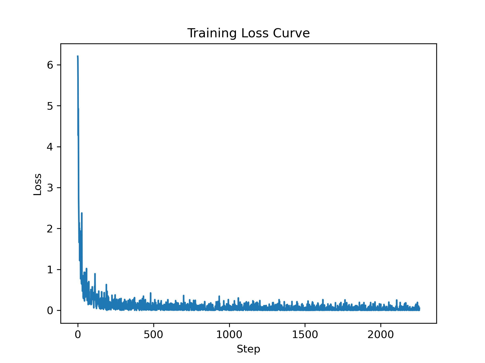
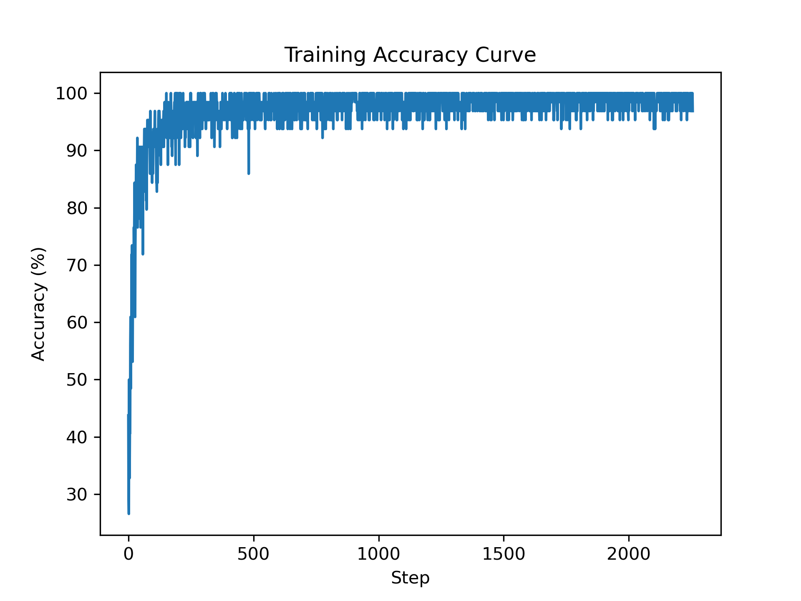

# Deep Learning 2021 - Homework 1
> Name: Sahand Sabour					Student ID: 2020280401

## Introduction

 
Logistic regression is a simple statistical model that uses a logistic function to model a binary variable. In this assigment, we were tasked to implement this model as a classifier for a simple 2-class subset of the MNIST digit dataset. As only 2 classes of these digits (3&6) are used, the classification results can be considered as binary where 3 and 6 are represented by 0 and 1.

## Implementation

### 1. Initialization

 
This model is implemented using python. The given set of inputs are a list of images (784 pixels) and each image has its own label (either 3 or 6). The given images are split into train and test sets to be used in training and testing stages. After the required preprocessing, the images are one-hot encoded. Therefore, each pixel would have a binary value and is regarded as an input. In addition to these 784 inputs, we would add a bias input with the value of 1; hence, the shape of the model's input would be 785. Accordingly, we would randomly initialize a weight for each of these inputs.

### 2. Training

 
The training section includes two passes: forward and backward pass. During the forward pass, the model predicts a label by calculating the sigmoid of the dot product between the input vector x and the weights vector w as follows:

$$
output = \frac{1}{1+e^{-(x\cdot w)}}
$$

 
During the backward pass, the cross-entropy loss is used to find the gradient and accordingly update the weights as follows:

$$
    \text{Cross-entropy loss }E(\theta) = -\frac{1}{N}\sum_{n=1}^{N}(t^{(n)}ln h(x^{(n)})+(1-t^{(n)})ln(1-h(x^{(n)})))
$$

$$
    \text{Gradient} \nabla E(\theta) = \frac{1}{N}\sum_{n}x^{(n)}(h(x^{(n)})-t^{(n)})
$$

$$
    w_{new} = w_{old} - \text{learning rate }*\nabla E(\theta)  
$$

 
The used training parameters are provided respectively below:

    learning rate = 0.1  
    number of epochs = 12  
    batch size = 64 

 
The obtained training loss and accuracy curves are provided in the following figures.

 
In addition, the recorded training and testing values are provided respectively below:

    Training Accuracy = 97.36605164007092%  
    Testing Accuracy =  98.54166666666667% 

