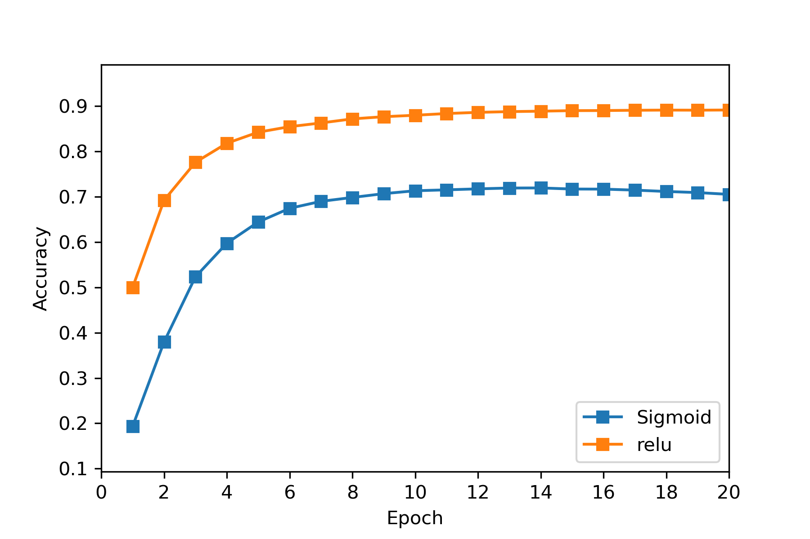

# Deep Learning 2021 - Homework 2
> Name: Sahand Sabour					
> Student ID: 2020280401

## Introduction

 
In this assignment, we are tasked to implement a Softmax classifier, which is a more general version of the previously implemented logistic regression classifier, as well as a multi-layer perceptron (MLP) to classify a series of handwritten digits from the MNIST dataset.

## Softmax for MNIST Classification

 
The implementation for this section is rather straightforward. We are given a jupyter notebook that loads and processes the MNIST dataset. Accordingly, it calls a function called softmax_classifier to get the values of loss, gradient and the predicted label respectively. Our job is to complete this function so that the rest of the notebook, which is the training and testing processes, can be executed. The necessary calculations for this implementation are provided respectively below:

$$
\text{output }h_{k}(x)=\text{Softmax}(x) = \frac{exp(w^{(k)T}x)}{\sum_{j=1}^{K}exp(w^{(j)T}x)}
$$

 
Where w and x are the weights and inputs vectors.

$$
\text{Cross-entropy loss } E(\theta)= -\frac{1}{N}\sum_{n=1}^{N}\sum_{k=1}^{K}t_k^{(n)}ln\text{ } h_k^{(n)}
$$

Where t is the labels (targets) vector. Adding a regularization term based on the L2-norm of the weights vector to the cross-entropy loss gives the following overall loss:
$$
\text{loss} = E(\theta) + \frac{\lambda}{2}||w||^2_2
$$
Where lambda is the regularization strength and is a hyper-parameter.
$$
\text{Gradient} \frac{\delta E}{\delta \theta^{(k)}} = -\frac{1}{N}(t_k^{(n)}-h_k^{(n)})x^{(x)}
$$
Accordingly, the predicted label is the highest value in the output vector (*argmax(output)*). 

The obtained training loss and accuracy curves are provided in the following figures.

In addition, the recorded training and testing values are provided respectively below:

    Training Accuracy = 89.00%  
    Testing Accuracy =  90.22% 

Lastly, we were asked to experiment with the different values of hyper-parameters and analyze the corresponding performance of the classifier.

1. **Regularization Strength (lambda)**

   | Lambda | Training Loss | Training Accuracy (%) | Testing Accuracy (%) |
   | :----: | :-----------: | :-------------------: | :------------------: |
   |  0.0   |    0.4123     |          90%          |        90.26%        |
   |  0.2   |    0.9150     |          92%          |        90.28%        |
   |  0.5   |    1.9028     |          89%          |        90.22%        |
   |  0.8   |    2.8469     |          88%          |        90.28%        |
   |  1.0   |    3.4279     |          86%          |        90.06%        |

   

   It can be realized that with higher values of lambda, we would have a higher loss, which is evident since the regularization term is a part of the total loss. It can also be observed that with an appropriate value (in this case, lambda = 0.2), we could have better performance in both training and testing stages.
   

2. **Learning Rate (when lambda =0.2)**

   | Learning Rate | Training Loss | Training Accuracy (%) | Testing Accuracy (%) |
   | :-----------: | :-----------: | :-------------------: | :------------------: |
   |     0.01      |    1.0341     |          88%          |        90.22%        |
   |      0.1      |    1.0709     |          95%          |        92.26%        |
   |      0.2      |    1.5500     |          94%          |        92.15%        |
   |      0.5      |    1.5601     |          93%          |        91.98%        |

   

   It is observed that with really low values of learning rate, the learning process is highly slowed down and with only a few epochs of training, a higher learning rate would achieve better results. However, learning rates that are too large, which cause the model to change too fast while training, also decreasing the learning. Therefore, the value of the learning rate should not be too small nor too large.
   

3. **Batch size  (when lambda =0.2 and learning rate = 0.1)**

   | Batch size | Training Loss | Training Accuracy (%) | Testing Accuracy (%) |
   | :--------: | :-----------: | :-------------------: | :------------------: |
   |     16     |    2.4508     |         87.5%         |        92.04%        |
   |     32     |    0.9150     |         87.5%         |        92.06%        |
   |     64     |    1.6005     |        92.19%         |        92.19%        |
   |    100     |    2.8469     |          93%          |        91.94%        |

4. **Max epoch (when lambda =0.2, learning rate = 0.1, batch size = 64)**

   | Max epoch | Training Loss | Training Accuracy (%) | Testing Accuracy (%) |
   | :----: | :-----------: | :-------------------: | :------------------: |
   |  2   |  1.1003 |          85.94%          |        91.24%        |
   |  5   |  1.4524 |          91%          |        91.64%        |
   |  10   |    1.6005     |          93%          |        92.19%        |
   |  20   |  1.6818 |          93.75%          |        90.28%        |

   

   The above two tables demonstrate that with smaller batch size and more epochs, we would achieve better training performance, as the model sees the training data more often and changes its weights in accordance to the training labels. However, at some point, the model becomes too familiar with the training data and loses its ability to generalize: it would overfit and have lower testing performance.
   

   
   

## MLP for MNIST Classification

 
The implementation for this section is more complex compared to the first section. We are once again given a jupyter notebook that loads and processes the MNIST dataset. Accordingly, it calls a script for training the given models. The notebook includes different combinations of layers to construct, train, and test different variations of the MLP. Our job is to complete these layers, criterions, and optimizers so that the rest of the notebook, which is the training and testing processes, can be executed. The necessary calculations for this implementation are provided respectively below:

- **Stochastic Gradient Descent Optimizer**
  $$
  \Delta w = \alpha\frac{\delta E}{\delta w_{ij}^{(l)}} + \alpha \lambda w_{ij}^{(l)} \\
  \Delta b = \alpha\frac{\delta E}{\delta b_{j}^{(l)}}
  $$
  where lambda is the weight decay and alpha is the learning rate.

- **FC Layer**
  $$
  \text{Forward pass} \rightarrow  y^{(l)}= w^Tx + b \\
  \text{Backward pass} \rightarrow  \delta^{(l-1)} = (w^{(l)})^T\delta^{(l)}\text{ , } \frac{\delta E}{\delta W^{(l)}} = \delta^{(l)}(y^{(l-1)})^T\text{ and }  \frac{\delta E}{\delta b^{(l)}} = \delta^{(l)}
  $$

- **ReLU Layer**
  $$
  \text{Forward pass} \rightarrow  y^{(l)} = max(0, x) \\
  \text{Backward pass} \rightarrow  \delta^{(l-1)} = \delta^{(l)} \cdot f'(y^{(l-1)}) \text{ given } f'(x) = \text{1 if $x\ge0$ else 0}
  $$

- **Sigmoid Layer**
  $$
  \text{Forward pass} \rightarrow  y^{(l)} = \frac{1}{1+exp(-x)} \\\text{Backward pass} \rightarrow  \delta^{(l-1)} = \delta^{(l)} \cdot f'(y^{(l-1)}) \text{ given } f'(x) = f(x)(1-f(x))
  $$
  
- **Euclidean Loss Layer**
  $$
  \text{Euclidean Loss} \rightarrow  E^{(n)} = \frac{1}{2} \sum_{k=1}^{K} ||y^{(l)}-t||^2 \\
  \text{Backward pass} \rightarrow  \delta^{(l)} = y^{(l)} - t
  $$
  
- **Softmax Cross-Entropy Loss Layer**
  $$
  \text{Forward pass} \rightarrow  y^{(l)} = \frac{exp(w_{k}^{(l)T}y^{(l-1)}+b_k^{(l)})}{\sum_{i=1}^{K}exp(w_{i}^Ty^{(l-1)})+b_i^{(l)})} \\ 
  \text{Softmax CE Loss} \rightarrow E^{(n)} = -\sum_{K}^{k=1} t_k ln y^{(l)} \\
  \text{Backward pass} \rightarrow  \delta^{(l-1)} = y^{(l)} - t
  $$

The obtained training loss and accuracy curves are provided in the following figures.

- **MLP with Euclidean Loss**

- **MLP with Softmax Cross-Entropy Loss**

- **MLP with 2 layers (Softmax CE loss and ReLU activation**

| # Hidden layers |       Loss Function        | Activation Function | Training Accuracy (%) | Validation Accuracy (%) | Testing Accuracy (%) |
| :-------------: | :------------------------: | :-----------------: | :-------------------: | :---------------------: | :------------------: |
|        1        |       Euclidean loss       |        ReLU         |        84.38%         |         88.70%          |        85.75%        |
|        1        | Softmax cross-entropy loss |        ReLU         |        85.55%         |         89.14%          |        86.81%        |
|        1        |       Euclidean loss       |       Sigmoid       |        76.41%         |         80.84%          |        78.21%        |
|        1        | Softmax cross-entropy loss |       Sigmoid       |        66.56%         |         70.52%          |        68.39%        |
|        2        | Softmax cross-entropy loss |        ReLU         |        86.30%         |         89.71%          |        87.28%        |

 
Based on the above table, a few conclusions in regards to comparison between different activation functions, loss functions, and number of hidden layers can be drawn.

1. 

   In comparison to using the Sigmoid function, the ReLU function gave considerably higher accuracies in all three stages (training, validation, and testing) regardless of the type of loss function. Based on the provided figures, ReLU was also able to converge at a much faster pace and achieve significantly lower loss. Regarding the training time, since calculating the ReLU function lacks the complexity of calculating the sigmoid (as ReLU could be implemented by a simple comparison of the value with 0), training a model which uses ReLU takes less time.
   

2. 
 The difference between the two types of loss functions depends on the activation function used. As seen in the above table, Softmax is able to slightly outperform Euclidean loss when ReLU is used but it is considerably outperformed when using a sigmoid activation function. The training time is expected to be shorter for euclidean loss as it is less computationally complex. Based on the figures, convergence seems to be fairly similar. Therefore, it can be realized that using sigmoid with softmax leads to the vanishing gradient problem, which could explain the unsatisfactory results.

3. 
 The MLP model with an additional hidden layer outperforms the original MLP mode in all accuracies. Hence, it can be realized that using additional hidden layers would improve the model's accuracy. However, adding additional layers increases the computational cost and training time; it is also vulnerable to overfitting. Hence, when creating an MLP model, the number of layers is usually limited to 2 or 3 as standard practice.

Lastly, we were asked to experiment with the different values of hyper-parameters and analyze the corresponding performance of the classifier. Here, only the change of hyperparameters in the MLP with 2 hidden layers (Softmax CE loss and ReLU activation) would be reported since the same behavior is expected from the other models. In addition, this model was selected as it achieved the highest accuracy.

1. **SGD learning rate**

   | SGD learning rate | Training Loss | Training Accuracy (%) | Validation Accuracy (%) | Testing Accuracy (%) |
   | :---------------: | :-----------: | :-------------------: | :---------------------: | :------------------: |
   |      0.0001       |    1.0533     |        78.53%         |         82.90%          |        79.91%        |
   |       0.001       |    0.8059     |        86.64%         |         90.02%          |        87.73%        |
   |       0.01        |    0.8929     |        81.03%         |         84.86%          |        81.96%        |
   |        0.1        |    0.9047     |        77.61%         |         81.08%          |        78.38%        |

   

   The learning rate in SGD should be comparatively much smaller than batch gradient descent as there are many more parameters involved that need to be updated. Hence, smaller values of this hyper-parameter are used. However, if the learning rate is too small, the training time before convergence would considerably increase, which is not satisfactory. The above table shows that an appropriate value of learning rate (not too small nor large) can achieve the best performance.
   

2. **Weight Decay**

   | Weight Decay | Training Loss | Training Accuracy (%) | Validation Accuracy (%) | Testing Accuracy (%) |
   | :----------: | :-----------: | :-------------------: | :---------------------: | :------------------: |
   |    0.001     |    0.3043     |        91.48%         |         93.76%          |        91.92%        |
   |     0.01     |    0.3363     |        91.03%         |         93.46%          |        91.72%        |
   |     0.1      |    0.8107     |        86.18%         |         89.76%          |        87.13%        |
   |     0.2      |    1.5464     |        70.28%         |         73.56%          |        71.08%        |

   

   Similar to the learning rate, it can be observed that smaller values of weight decay obtain better performance. It can also be seen that larger values of weight decay have a significantly decreased performance, which demonstrates that the value of weight decay should be rather small.
   

   

3. **Batch Size and Max Epoch**
   

   Changing the batch size and maximum number of epochs is expected to have the same results as the first section since it follows the same logic.
   

