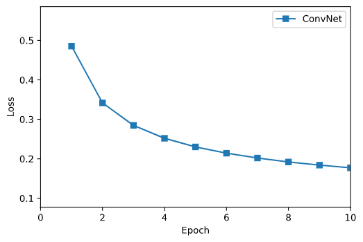
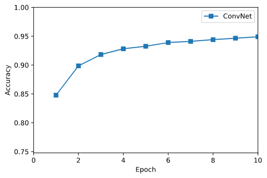

# Deep Learning 2021 - Homework 3
> Name: Sahand Sabour					
> Student ID: 2020280401

## Introduction

 
In this assignment, we are tasked to implement a Convolutional Neural Network (ConvNet) to classify a series of handwritten digits from the MNIST dataset.

## ConvNet for MNIST Classification

 
The implementation for this section is rather straightforward. We are given a jupyter notebook that loads and processes the MNIST dataset. Accordingly, we are required to complete the layers of this ConvNet model so that the model can be trained and tested. The necessary calculations for this implementation are provided respectively below:

### Calculations

- **FC Layer**
  $$
  \text{Forward pass} \rightarrow  y^{(l)}= w^Tx + b \\
  \text{Backward pass} \rightarrow  \delta^{(l-1)} = (w^{(l)})^T\delta^{(l)}\text{ , } \frac{\delta E}{\delta W^{(l)}} = \delta^{(l)}(y^{(l-1)})^T\text{ and }  \frac{\delta E}{\delta b^{(l)}} = \delta^{(l)}
  $$

- **ReLU Layer**
  $$
  \text{Forward pass} \rightarrow  y^{(l)} = max(0, x) \\
  \text{Backward pass} \rightarrow  \delta^{(l-1)} = \delta^{(l)} \cdot f'(y^{(l-1)}) \text{ given } f'(x) = \text{1 if $x\ge0$ else 0}
  $$

- **Sigmoid Layer**
  $$
  \text{Forward pass} \rightarrow  y^{(l)} = \frac{1}{1+exp(-x)} \\\text{Backward pass} \rightarrow  \delta^{(l-1)} = \delta^{(l)} \cdot f'(y^{(l-1)}) \text{ given } f'(x) = f(x)(1-f(x))
  $$
  
- **Softmax Cross-Entropy Loss Layer**
  $$
  \text{Forward pass} \rightarrow  y^{(l)} = \frac{exp(w_{k}^{(l)T}y^{(l-1)}+b_k^{(l)})}{\sum_{i=1}^{K}exp(w_{i}^Ty^{(l-1)})+b_i^{(l)})} \\ 
  \text{Softmax CE Loss} \rightarrow E^{(n)} = -\sum_{K}^{k=1} t_k ln y^{(l)} \\
  \text{Backward pass} \rightarrow  \delta^{(l-1)} = y^{(l)} - t
  $$

- **Pooling Layer**
  $$
  \text{Forward pass} \rightarrow  y^{(l)} = max(y^{(l-1)}) \\ 
  \text{Backward pass} \rightarrow  \delta^{(l-1)} = \delta^{(l)} \text{ if }y^{(l-1)}=y^{(l)}\text{ else } 0
  $$

- **Convolution Layer**
  $$
  \text{Forward pass} \rightarrow  h[m,n] = \sum_{n=1}^{N}\sum_{c=1}^C\sum_{i=1}^H\sum_{j=1}^W y^{(l-1)}_{m+i, m+j} w^{(l)}_{i,j} + b_{i,j}\\ 
  \text{Backward pass} \rightarrow  \delta_w^{(l-1)} = \delta_w^{(l)}*_{valid}w^{(l)}\text{ and }\delta_b^{(l-1)} = \sum \delta_b^{(l)}
  $$

  

### Results

The obtained training loss and accuracy curves are provided in the following figures.

In addition, the recorded training and testing values are provided respectively below:

    Training Accuracy = 92.94%  
    Testing Accuracy =  93.82% 

### Comparison with MLP

In this section, we compare the performance of the ConvNet model with a previously implemented MLP architecture that uses ReLU activation function and Softmax cross-entropy loss as the same activation and loss functions are used in the current implementation of ConvNet.

1. **Training time**

   
 
   Due to the much higher complexity and increase in the number of layers, the training time of ConvNet is significantly longer than MLP. It is acknowledged that modifications, such as im2col method, could be used to improve the training time of CNN architecture; however, the training time for this model would still be much longer than the MLP architecture.
   

2. **Accuracy**

   
 
   The overall accuracy of CNN, both in training and testing stages, is compartively higher than the obtained results of the MLP architecture. Hence, it could be realized that the additional complexity of the CNN architecture may be worthwhile.
   

3. **Convergence**

   
 
   Given the obtained results for the training loss curve of the ConvNet model and the previously provided MLP results, it is evident that MLP converges at a much higher pace (<10 epochs), whereas the CNN model doesn't seem to be converging in the 10 epochs that it was trained.
   

### Hyper-parameters

We were also asked to experiment with the different values of hyper-parameters and analyze the corresponding performance of the classifier.

1. **Learning Rate**

   | Learning Rate | Training Loss | Training Accuracy (%) | Testing Accuracy (%) |
   | :-----------: | :-----------: | :-------------------: | :------------------: |
   |    0.0001     |    0.5603     |        82.64%         |        84.32%        |
   |     0.001     |    0.3417     |        92.94%         |        93.82%        |
   |     0.01      |    0.2146     |        94.26%         |        93.66%        |
   |      0.1      |    2.5035     |         9.63%         |        9.82%         |

   

   Due to the compartively higher complexity of ConvNet, the learning rate must also be set to compartively lower values. Hence, when the learning rate is increased to values such as 0.1, the loss increases significantly and the performance plummets. It is also observed that with really low values of learning rate, such as 0.0001, the learning process is highly slowed down and the model does not reach its peak performance within 10 epochs. Hence, for this architecture, a low enough learning rate is needed for convergence, but it must be too low to limit the model's potential performance.
   

2. **Weight Decay**

   | Weight Decay | Training Loss | Training Accuracy (%) | Testing Accuracy (%) |
   | :--------: | :-----------: | :-------------------: | :------------------: |
   |   0.0005   |    0.2741     |        91.94%         |        92.95%        |
   |   0.005    |    0.3417     |        92.94%         |        93.82%        |
   |    0.05    |    0.4158     |        90.48%         |        91.55%        |
   |    0.5     |    2.3087     |         9.88%         |        9.80%         |

   

   Similar to the learning rate, it can be observed that smaller values of weight decay obtain better performance while comparatively larger values, such as 0.5, cause the performance to heavily decrease. This demonstrates that the value of weight decay, like learning rate, should be rather small but large enough that the performance potential of the model within few epochs is utilized.
   

3. **Max epoch and Batch size**

   

   As seen in the previous assignment, it would be evident that by choosing smaller batch size and having more epochs, we would achieve better training performance, as the model sees the training data more often and changes its weights in accordance to the training labels. However, at some point, the model may become too familiar with the training data and loses its ability to generalize: it would overfit and have lower testing performance. Hence, a balance must be found.
   

### Implementing Dropout

**Dropout**: Given a probability p, each hidden unit may be randomly neglected from the network.

In this section, we provide the obtained results regarding analysis of the different locations of the dropout layer and the effect of different dropout rates.

1. **Location**

   |        Location        | Training Loss | Training Accuracy (%) | Testing Accuracy (%) |
   | :--------: | :-----------: | :-------------------: | :------------------: |
   |   Before Pooling   | 0.2618 |        92.11%        |        93.17%        |
   |   Before Convolution   | 0.4477 |        85.58%        |        89.36%        |
   |    Before Fully Connected    | 0.4317 |        87.11%        |        92.18%        |

   

   In the original paper (Hinton, 2012), the dropout layer was added before the fully connected layer. However, in this implementation and based on the obtained results, it was noticed that adding the dropout layer before the maxpooling layer provided the best results.
   

2. **Rate**

   | Dropout Rate | Training Loss | Training Accuracy (%) | Testing Accuracy (%) |
   | :--------: | :-----------: | :-------------------: | :------------------: |
   |   0.1   |  0.2913 |        91.32%        |        92.46%        |
   |  0.2 |    0.2618     |        92.11%         |        93.17%        |
   |    0.5     |  0.3946 |         87.65%         |        90.88%        |

   

   Dropout is a means of regularization. Hence, really small values may have inconsiderable effect on the performance while significantly large rates are highly likely to discard important features of the input; the performance of the model decreases considerably in both of these cases. Therefore, as shown by the obtained results, an appropriate value of dropout rate (not too small and not too large) must be selected.
   

