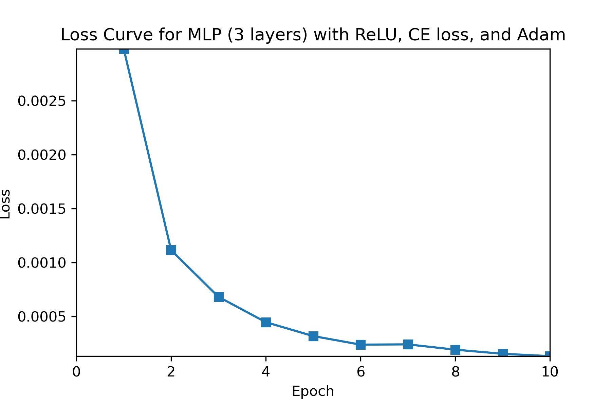

# Deep Learning 2021 - Homework 4
> Name: Sahand Sabour					
> Student ID: 2020280401

## Introduction

 
In this assignment, we are tasked to use Pytorch to implement a Multi-Layer Perceptron (MLP) and a Convolutional Neural Network (ConvNet) to classify a series of handwritten digits from the MNIST dataset.

## Pytorch for MNIST Classification

 
Different from the previous assignments, the students have full control of the flow of the program (such as data pre-processing, training, testing, etc.). For reading and processing the dataset, the torchvision library is utilized to gather preprocessed mnist data that is already divided into training and testing sets. Accordingly, the nn module from pytorch is used to create the models and different optimizers and losses, which are also readily available straight from pytorch, are also utilized. Since all the models are implemented by using built-in modules, no further calculations are provided in this report.

## Multi-Layer Perceptron (MLP)

 
The Multi-Layer Perceptron (MLP) model, is a composition of multi layers of the simple Perceptron architecture, which is able to learn non-linearly separable relationships between the input features and the targets. Essentially, an MLP model requires linear layers (i.e. input layer + hidden layers) as well as non-linear activation layers that are stacked back to back. The number of these layers is arbitrary but in practice, 2-3 layers are used. In this assignment, MLP models with different architectures and configurations are implemented, trained, and tested via Pytorch. The obtained results for each configuration and discussion on the comparison of different configurations is provided respectively below.

 
For all the following implementations, the hyper-parameters in the below table were used.

| Batch Size | Max Epoch | Learning Rate | Weight Decay |
| :--------: | :-------: | :-----------: | :----------: |
|    100     |    10     |     0.001     |    0.005     |

### Experiments and Results

#### 1. MLP with 1 Hidden Layer (ReLU activation, Cross-entropy loss, and SGD optimizer)

The obtained training loss and accuracy curves are provided in the following figures.

    Training Loss = 0.0089  
    Training Accuracy = 82.17%  
    Testing Accuracy =  83.43% 

#### 2. MLP with 1 Hidden Layer (Sigmoid activation, Cross-entropy loss, and SGD optimizer)

    Training Loss = 0.0212  
    Training Accuracy = 53.05%  
    Testing Accuracy =  55.09% 

#### 3. MLP with 1 Hidden Layer (ReLU activation, Cross-entropy loss, and Adam optimizer)

    Training Loss = 0.00032  
    Training Accuracy = 99.16%  
    Testing Accuracy =  97.45% 

#### 4. MLP with 2 Hidden Layers (ReLU activation, Cross-entropy loss, and Adam optimizer)

    Training Loss = 0.00014  
    Training Accuracy = 99.53%  
    Testing Accuracy =  97.80% 

### Discussion

For a more clear comparison, the above results are summarized in the table below:

|                        Configuration                         | Training Accuracy (%) | Testing Accuracy (%) |
| :----------------------------------------------------------: | :-------------------: | :------------------: |
| MLP with 1 Hidden Layer (ReLU activation, Cross-entropy loss, and SGD optimizer) |         82.17         |        83.43         |
| MLP with 1 Hidden Layer (Sigmoid activation, Cross-entropy loss, and SGD optimizer) |         53.05         |        55.09         |
| MLP with 1 Hidden Layer (ReLU activation, Cross-entropy loss, and Adam optimizer) |         99.16         |        97.45         |
| MLP with 2 Hidden Layers (ReLU activation, Cross-entropy loss, and Adam optimizer) |         99.53         |        97.80         |

The comparison is three-fold:

1. **Activation Function**

   
 
   Similar to previous experiments, the ReLU activation function considerably outperformed the model using Sigmoid activation function. In comparison between the first two models, since they only differ in the activation function, the model using ReLU was also able to obtain significantly lower loss. This may be due to the fact that the sigmoid function is vulnerable to the vanishing gradient problem. In addition, since the ReLU function is less mathemathically complex, the training time using this activation function would also be smaller.
   

2. . **Optimizer**

   
 
   Models 1 and 3 show the effects of different optimizers. As shown by the results, the Adam optimizer outperforms the Stochastic Gradient Descent approach within few epochs. Training the model using the Adam optimizer was also fairly faster in comparison to using the SGD optimizer.
   

3. **Number of Layers**

   
 
   As mentioned, in practice, 1-2 hidden layers (2-3 layers in total) are used for an MLP model. Models 3 and 4 demonstrate the difference between using different number of hidden layers. As shown above, the results are rather similar but the MLP model with an extra hidden layer achieves slightly higher training and testing accuracy. However, the addition of a hidden layer also increases the computational complexity and therefore, it also increases the training time.
   

## Convolutional Neural Network (ConvNet)

 
The Convolutional Neural Netowrk (CNN or ConvNet) is a fundamental deep learning model in the field of image processing. It utilizes concepts from linear algebra, mainly convolution, to find the important features of the input and learn a mapping between these features and the target output. In a sense, ConvNets can be considered as the regularized version of the MLP architecture, as MLP is subject to overfitting due to the fact that all the neurons within this architecture are connected to one another (Fully-connected architecture). In CNNs, the hierarchical pattern in the input features are utilized to decrease the complexity of the original input by breaking down and representing these features by a subset of them. A typical ConvNet model includes a convolution layer, a pooling layer (max pooling in this assignment), and a non-linear activation layer. In this section of the assignment, ConvNet models with different architectures and configurations are implemented, trained, and tested via Pytorch. Similar to the previous section, the obtained results for each configuration and discussion on the comparison of different configurations is provided respectively below.

 
For all the following implementations, the hyper-parameters in the below table were used.

| Batch Size | Max Epoch | Learning Rate | Weight Decay |
| :--------: | :-------: | :-----------: | :----------: |
|    100     |    10     |     0.001     |    0.005     |

### Experiments and Results

#### 1. ConvNet with 2 Convolution Layers (ReLU activation, Cross-entropy loss, and SGD optimizer)

    Training Loss = 0.009  
    Training Accuracy = 75.60%  
    Testing Accuracy =  79.13% 

#### 2. ConvNet with 2 Convolution Layers (Sigmoid activation, Cross-entropy loss, and SGD optimizer)

    Training Loss = 0.023  
    Training Accuracy = 11.23%  
    Testing Accuracy =  11.35% 

#### 3. ConvNet with 2 Convolution Layers (ReLU activation, Cross-entropy loss, and Adam optimizer)

    Training Loss = 0.00021  
    Training Accuracy = 99.39%  
    Testing Accuracy =  98.68% 

#### 4. ConvNet with 3 Convolution Layers (ReLU activation, Cross-entropy loss, and Adam optimizer)

    Training Loss = 0.00029  
    Training Accuracy = 99.10%  
    Testing Accuracy =  98.47% 

### Discussion

For a more clear comparison, the above results are summarized in the table below:

|                        Configuration                         | Training Accuracy (%) | Testing Accuracy (%) |
| :----------------------------------------------------------: | :-------------------: | :------------------: |
| ConvNet with 2 Convolution Layers (ReLU activation, Cross-entropy loss, and SGD optimizer) |         75.60         |        79.13         |
| ConvNet with 2 Convolution Layers (Sigmoid activation, Cross-entropy loss, and SGD optimizer) |         11.23         |        11.35         |
| ConvNet with 2 Convolution Layers (ReLU activation, Cross-entropy loss, and Adam optimizer) |         99.39         |        98.68         |
| ConvNet with 3 Convolution Layers (ReLU activation, Cross-entropy loss, and Adam optimizer) |         99.10         |        98.47         |

The comparison is three-fold:

1. **Activation Function**

   
 
   Similar to MLP, the ReLU activation function considerably outperformed the model using Sigmoid activation function. Using the Sigmoid function in ConvNet was observed to be a horrible addition as the accuracy was significantly low when using this activation function. Hence, it is best to use ReLU when choosing between these two activation functions in a CNN model.
   

2. . **Optimizer**

   
 
   The comparison between the SGD and Adam optimizers is demonstrated by the results of Models 1 and 3. Based on the obtained results, similar to MLP, the Adam optimizer outperforms the Stochastic Gradient Descent approach within the 10 epochs that the models were trained. Training the model using the Adam optimizer was also faster when training a CNN model.
   

3. **Number of Layers**

   
 
   Models 3 and 4 demonstrate the difference between using different number of layers (convolution and pooling). As shown above, the results are rather similar but unlike the MLP model, the addition of an extra layer achieves slightly lower training and testing accuracy. This addition also increases the already expensive computational cost of the CNN architecture.
   

## Comparison of MLP and ConvNet

 
The MLP model with ReLU activation, Cross-Entropy loss, Adam optimizer, and 2 hidden layers achieved the best performance among different configurations of this model. In addition, the ConvNet model with ReLU activation, Cross-Entropy loss, Adam Optimizer, and 2 Convolution layers achieved the best performance among the experimented CNN configurations. Since the same training and testing data as well as the same hyper-parameters were used to train these two models, the following comparison is believed be logical. The comparison is made from three aspects: training time, accuracy, and convergence. 

1. **Training Time**

   
 
   As mentioned, the ConvNet model is considerably more computationally complex and expensive in comparison with the MLP model. Utilizing methods such as im2col, which is used by Pytorch, can significantly decrease this complexity. However, this improvement still requires more computational resources and time for training when compared to MLP.
   

2. **Accuracy**

   
 
   Based on the obtained results, the best MLP model was able to obtain slightly better performance than the best ConvNet model during training. However, the ConvNet model outperforms the MLP model during testing. As previously mentioned, ConvNet can be considered as a regularized version of the MLP since the MLP architecture is vulnerable to overfitting and the above experimental results further support this point.
   

3. **Convergence**

   
 
   Both of the models were trained for 10 epochs. The models both seem to have converged within these 10 epochs; however, the MLP model demonstrates faster convergence in comparison to the ConvNet model.
   

