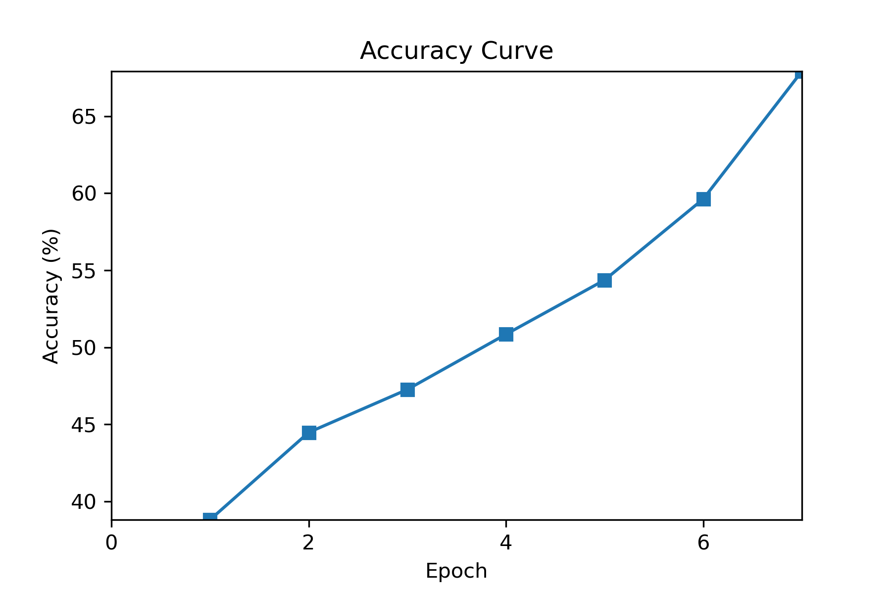

# Deep Learning 2021 - Homework 5

> Name: Sahand Sabour					
> Student ID: 2020280401

## Introduction

 
In this assignment, we are tasked to use Pytorch to do Sentence-Level Sentiment Classification on the Stanford Sentiment Treebank (SST) dataset. Each line in this dataset is a sentence and its corresponding label (sentiment). There are 5 possible labels for each sentence: very negative (0), negative (1), neutral (2), positive (3), and very positive (4). Upon pre-processing, there's an additional label "unk", which is reserved for unknown sentiments.

## Pytorch for Sentiment Classification

 
For this task, Torchtext and the provided code snippets were utilized to pre-process the SST dataset, create a vocabulary based on a pre-trained embedding file, and create data iterators for the training, validation, and testing of the model respectively. Accordingly, the built-in modules from Pytorch's nn library, such as LSTM model and linear layers, were used to create the model for this assignment.

## Bi-Directional Long Short Term Memory (Bi-LSTM)

 
The model used for this assignment is Bi-LSTM. Firstly, let us explore the LSTM architecture. LSTM is an improved Recurrent Neural Network (RNN) model in a sense that it resolves the vanishing gradient issue that exists with normal RNNs. These type of models are useful where data is presented in sequences (either on a time-scale or in the case of this assignment, sentences). The feature that makes LSTMs superior to a normal RNN is the addition of a forget gate that enables the model to discard really old inputs. 

 
In the unidirectional version of these architectures, which were initially proposed and widely used, at each step, the model produces an output based on the previous outputs. However, in cases that information from the future (outputs from the steps after this step) are useful, the model would have no way to utilize this information. For instance, when analyzing a word in sentence in order to classify the sentence's sentiment, we need information from the words before and after each word. Hence, the bidirectional structure, which provides information from both the past and the future could be utilized.

 
The Bi-LSTM model that is implemented in this assignment consists of two LSTM layers, three dropout layers, and a linear (FC) layer. When a sentence is given as input, each word of the sentence is transformed into its corresponding word vector based on the pre-trained embeddings. Accordingly, this input is fed to both the normal lstm layer and the reverse lstm layer. The output of these two layers is passed through two respective dropout layers and then fed to the second lstm layer. Accordingly, the corresponding outputs of these layers (outputs for the same steps) are concatenated. The final output would be taken from the last steps output. This output would then be passed through the third and final dropout layer and then fed into a linear layer to make the classification. This model is illustrated in the below figure. 

 
For this implementation, the following hyper-parameters were used.

| Batch Size | Max Epoch | Learning Rate |
| :--------: | :-------: | :-----------: |
|    100     |    10     |     0.001     |

Accordingly, the following configurations were used to create the model.

| Hidden Dimension | Number of Layers | Dropout Rate |
| :--------------: | :--------------: | :----------: |
|       512        |        2         |     0.2      |

### Results

The obtained training loss and accuracy curves are provided in the following figures.

    Training Loss = 1.366  
    Training Accuracy = 59.62%  
    Validation Accuracy = 45.33%  
    Testing Accuracy =  44.25% 

### Discussion

 
As shown in the figure, the training loss reached lower values and the training accuracy reached higher values than what was reported in the end. However, these results are after the model had over-fitted: meaning that although the training performance was continuously improving, the validation performance was plummeting. When training, an early stoppage condition was defined where if the validation performance does not improve for two epochs, the training process would be halted. Hence, the best results were believed to be ones were both the training and testing performance are fairly well, and in the conducted experiments, the model reached this point within 6 epochs and started overfitting afterwards.

