# Deep Learning 2021 - Homework 6

> Name: Sahand Sabour					
> Student ID: 2020280401

## Introduction

 
In this assignment, we are tasked to implement the EM algorithm for Gaussian mixture models and visualize the results using scatter plots. Accordingly, we were required to plot the results based on different number of clusters and iterations. The provided dataset (Iris) consists of 150 samples of three species of flowers (50 samples per flower type).

## The E-M Algorithm

$$
\text{E-Step:}\quad  \gamma(z_{nk}) = \frac{\pi_k \mathcal{N}(x_n|\mu_k, \Sigma_k)}{\sum_j\pi_j\mathcal{N}(x_n|\mu_j, \Sigma_j)} \\
\text{M-Step:}\quad \mu_k = \frac{1}{N_K}\sum_{n=1}^N \gamma(z_{nk})x_n \\
\quad \Sigma_k = \frac{1}{N_K}\sum_{n=1}^N \gamma(z_{nk})(x_n-\mu_k)(x_n-\mu_k)^T\\
\qquad \pi_k = \frac{N_K}{N}
$$

## Results and Discussions

 
The algorithm was tested with different number of clusters. The number of iterations was fixed to 500. The obtained results are provided in the table below:

|   #Clusters   | Cross Section |  PCA Projection |
| :----------------------------------------------------------: | :----------------------------------------------------------: | :-------------: |
| 2 |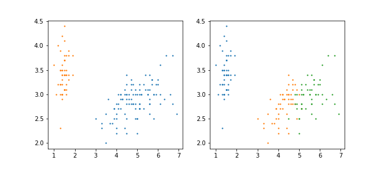 | 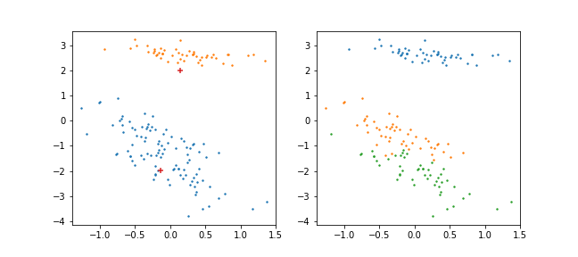|
| 3 |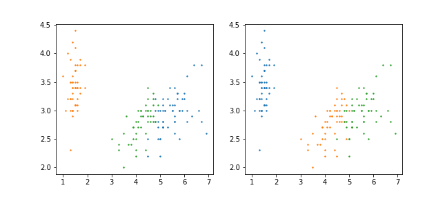 | 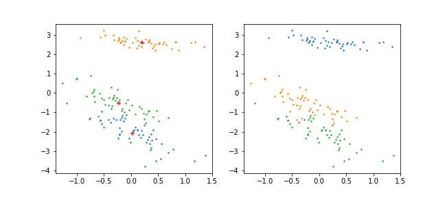|
| 5 |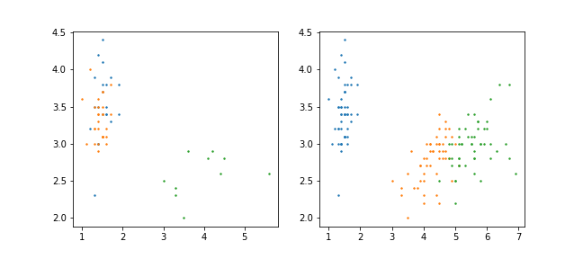 | 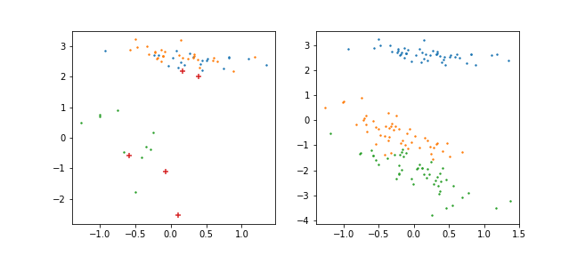|
| 7 |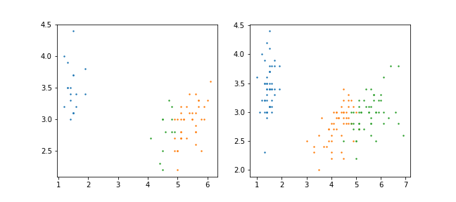 | 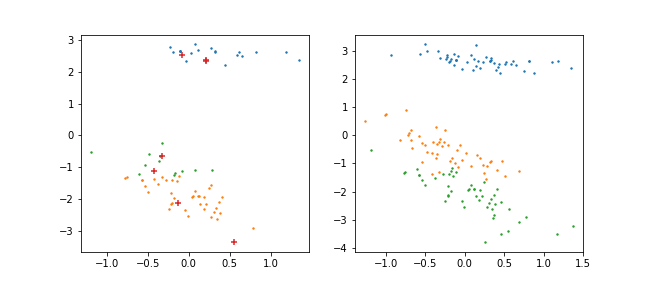|
| 10 |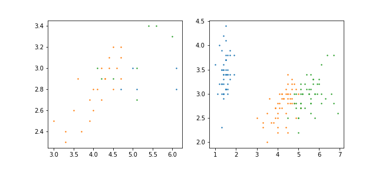 | 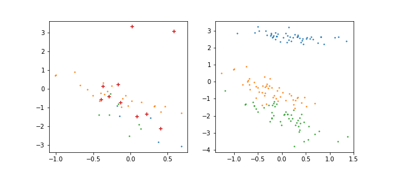|

 
As shown in the above figures, it can be observed that the EM Algorithm performs fairly well when the number of clusters is close to the actual number of classes; the model has the best performance (i.e. highest accuracy) when the number of clusters is set to three. This is evident as the similarity between the actual number of classes and the chosen number of clusters is highly correlated with the performance: if a much smaller number of clusters is used, samples of different classes would be classified as one single cluster; accordingly, if a much larger of number of clusters is used, samples of the same class would be assigned to different clusters. The algorithm was also tested for different number of iterations. The number of clusters was set to three. The obtained results are provided in the table below:

|   #Iterations   | Cross Section |  PCA Projection |
| :----------------------------------------------------------: | :----------------------------------------------------------: | :-------------: |
| 100 |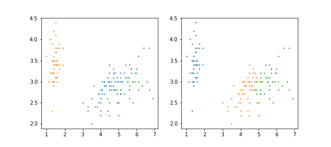 | 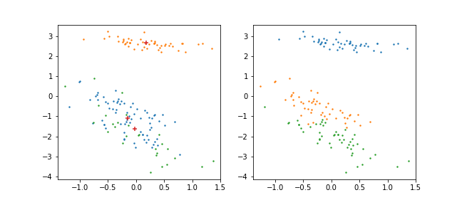 |
| 500 | | |
| 2000 |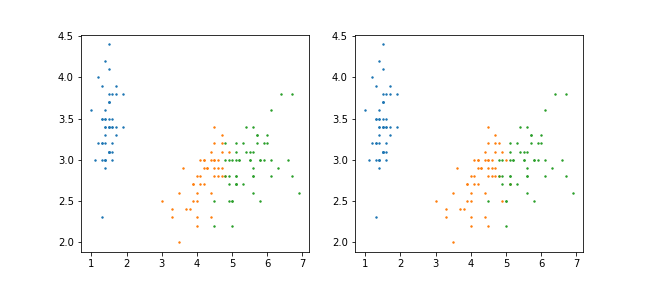 | 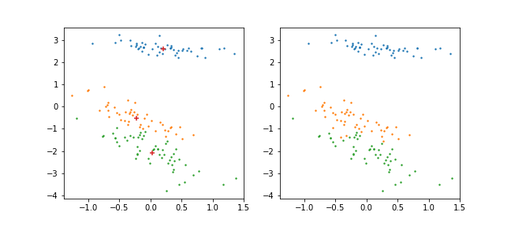|

 
Based on the above results (mainly the PCA projection), it can be observed that the variance is quite small in lower iterations and hence, samples of different classes may be assigned to the same cluster. However, this variance increases as the number of iterations is increased, which enables a more accurate classification of the sampels.

